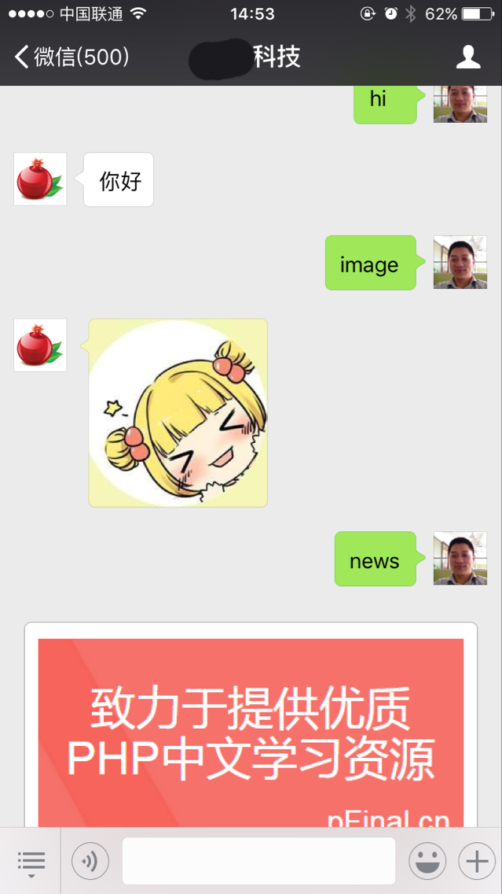
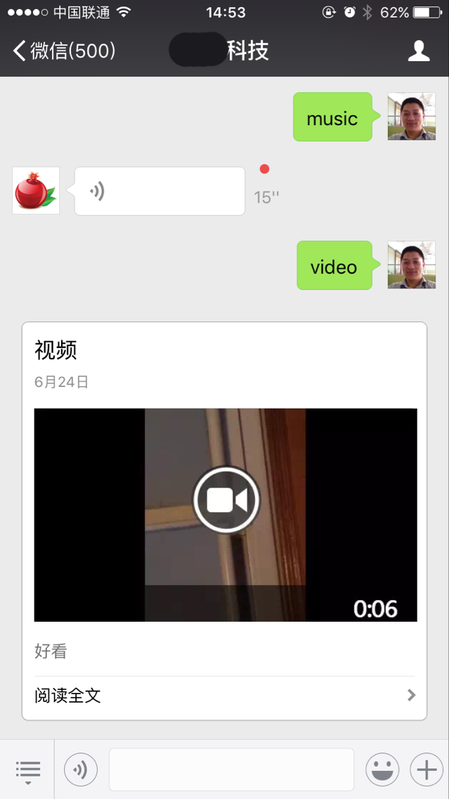
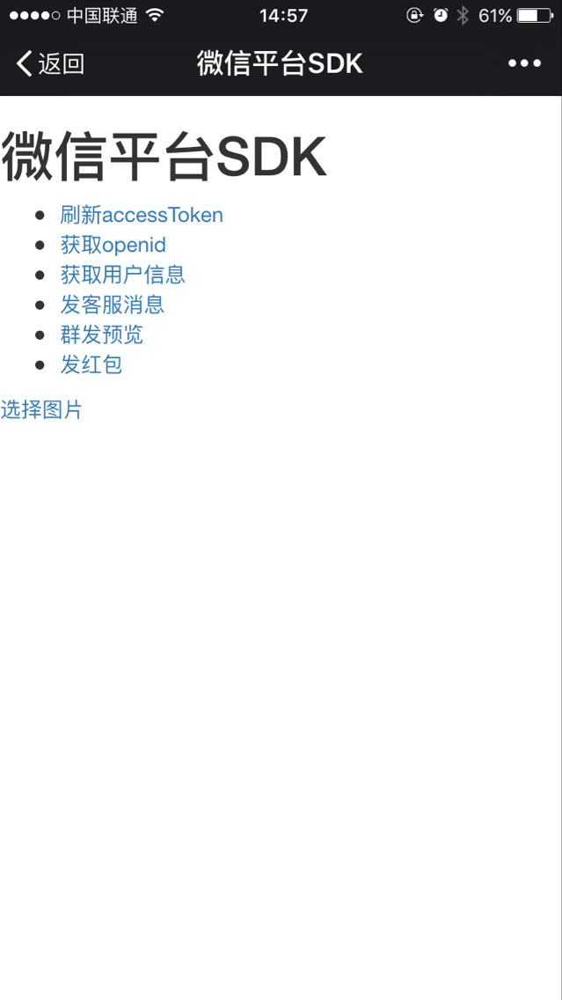
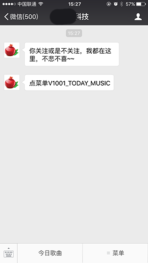

# [WeChat SDK](http://pfinal.cn)

一个简单易用的微信公众平台SDK。

>支持微信公众平台 https://mp.weixin.qq.com
>
>支持微信开放平台 https://open.weixin.qq.com

微信开发者交流 QQ 群：`16455997`

## 特点

 - 基于微信官方SDK简单封装，避免过度封装带来的额外学习成本以及影响扩展性;
 - 核心API类单文件，简单易用，隐藏开发者不需要关注的细节;
 - 抽象了消息事件，让你的控制器代码更优雅，扩展和维护更容易;
 - 详细的调试日志，让开发更轻松;
 - 支持PHP 5.3+、7.x版本;
 - 符合 [PSR](https://github.com/php-fig/fig-standards) 标准，非常方便与各主流PHP框架集成;

## 视频教程

> [http://www.pfinal.cn/subject/wechat](http://www.pfinal.cn/subject/wechat)
>
> [在线文档](doc/index.md)

## 安装

环境要求：PHP >= 5.3

* 使用 [composer](https://getcomposer.org/)

```shell
composer require pfinal/wechat
```

* 如果你的项目没有使用composer，请下载[完整包](https://github.com/pfinal/wechat/raw/master/dist/pfinal-wechat-full.zip)解压后,使用下面的代码进行加载

```php
<?php
    include_once __DIR__ . '/pfinal-wechat/autoload.php';
```

## 示例

查看demo中的示例  demo/server.php 是服务端

```php
<?php

require __DIR__ . '/../vendor/autoload.php';

use PFinal\Wechat\Kernel;
use PFinal\Wechat\Message\Receive;
use PFinal\Wechat\Message;
use PFinal\Wechat\WechatEvent;
use PFinal\Wechat\Support\Log;

//配置项
$config = array(
    'appId' => 'xxxxxxxxx',
    'appSecret' => 'xxxxxxxxxxxxxxxxxxxx',
    'token' => 'xxxxxx',
    'encodingAesKey' => 'xxxxxxxxxxxxxxxxxxxxxxxxxxxxxxxxxxxxxxxx',
);

//初始化
Kernel::init($config);

//消息处理
Kernel::register(Receive::TYPE_TEXT, function (WechatEvent $event) {
    $message = $event->getMessage();
    $event->setResponse('你好');
    $event->stopPropagation();
});

//关注事件
Kernel::register(Receive::TYPE_EVENT_SUBSCRIBE, function (WechatEvent $event) {
    $event->setResponse('你关注或是不关注，我都在这里，不悲不喜~~');
    $event->stopPropagation();
});

//处理微信服务器的请求
$response = Kernel::handle();

echo $response;

```

## 效果截图




