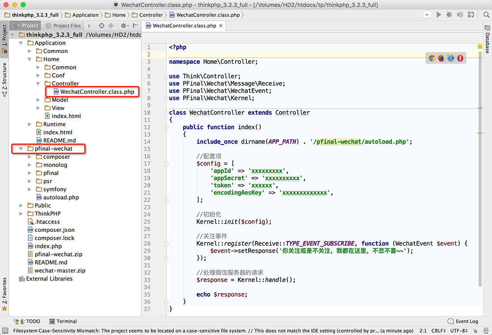

# 框架中使用

`pfinal/wechat`支持与主流PHP框架集成使用，框架是否支持`composer`均不影响，只要满足`pfinal/wechat`对的PHP环境的需求即可。


## Laravel

## Yii 2.x

## Yii 1.x

## Symfony

## CI

## ThinkPHP

* 下载完整版本 [点击这里](https://github.com/pfinal/wechat/raw/master/dist/pfinal-wechat-full.zip)
* 解压到项目的根目录(index.php所在目录)
* 新建一个WechatController控制器,示例代码如下

```PHP
<?php

namespace Home\Controller;

use Think\Controller;
use PFinal\Wechat\Message\Receive;
use PFinal\Wechat\WechatEvent;
use PFinal\Wechat\Kernel;
use PFinal\Wechat\Support\Log;

class WechatController extends Controller
{
    public function index()
    {
        include_once dirname(APP_PATH) . '/pfinal-wechat/autoload.php';

        //配置项
        $config = array(
            'appId' => 'xxxxxxxxx',
            'appSecret' => 'xxxxxxxxxx',
            'token' => 'xxxxxx',
            'encodingAesKey' => 'xxxxxxxxxxxxx',
        );

        //初始化
        Kernel::init($config);

        //关注事件
        Kernel::register(Receive::TYPE_EVENT_SUBSCRIBE, function (WechatEvent $event) {
            $event->setResponse('你关注或是不关注，我都在这里，不悲不喜~~');
        });

        //处理微信服务器的请求
        $response = Kernel::handle();

        echo $response;
    }
}
```

* 将项目上传到服务器上，假设域名为 pfinal.cn。进入`微信公众平台->开发->基本配置`后，`URL`处填入我们服务器地址 `http://pfinal.cn/index.php/home/wechat`

> 实际操作中，请更改`pfinal.cn`为你自己服务器的域名


