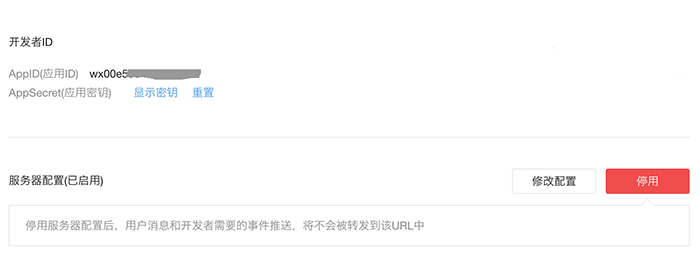

## 接入微信公众平台

公众平台接口调用仅支持80端口，需要准备一个公网服务器。
这里假设我们自己的服务器域名是 pfinal.cn，我们新增一个文件server.php，并将项目上传到服务器中

```PHP
<?php

// composer自动加载
require __DIR__ . '/../vendor/autoload.php';

// 如果你项目没有使用composer，使用下面代码代替上面的一句
// require __DIR__ . '/pfinal-wechat/autoload.php';

use PFinal\Wechat\Kernel;

// 配置项
$config = [
    'appId' => 'your-app-id',
    'appSecret' => 'your-secret',
    'token' => 'your-token',
    'encodingAesKey' => 'your-aes-key',
];

// 初始化
Kernel::init($config);

// 处理微信服务器的请求
$response = Kernel::handle();

// 将响应输出
echo $response; //Laravel、Yii2等框架中，使用 return $response;

```

进入`微信公众平台->开发->基本配置` 获取`AppID`、`AppSecret`，填入上面代码中对应的地方。修改服务器配置，`URL`处填入我们服务器地址 `http://pfinal.cn/server.php`，`Token`处填入一个随机字符串，生成`EncodingAESKey`。并将`Token`和`EncodingAESKey`填入上面代码中对应的地方，最后选择安全模式并点击提交。提示成功即完成了接入服务端验证。如果你想了解更多细节，可查阅 [微信官方的接入指引](http://mp.weixin.qq.com/wiki/17/2d4265491f12608cd170a95559800f2d.html)

> 实际操作中，请更改`pfinal.cn`为你自己服务器的域名
> 
> 请确保微信平台服务器配置已启用，成功启用后，将看到红色 “停用” 按扭，说明启用成功，如下图




